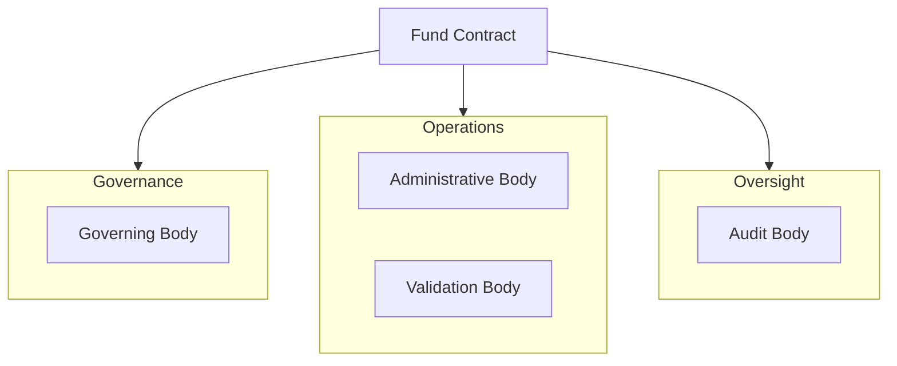

## Institutional Structure

```mermaid
graph TB
    A[Fund Contract]

    subgraph G [Governance]
        B[Governing Body]
    end

    subgraph O [Operations]
        C[Administrative Body]
        D[Validation Body]
    end

    subgraph S [Oversight]
        E[Audit Body]
    end

    A --> G
    A --> O
    A --> S
```